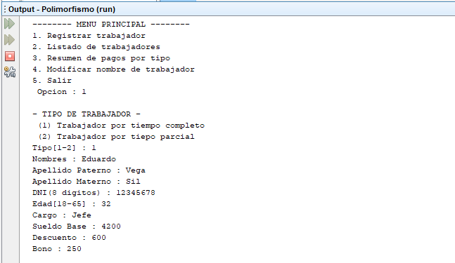

# Gestión de trabajadores
Sistema de gestión de trabajadores que permite registrar un trabajador, listar los trabajadores registrados, cantidad de pagos que se harán por tipo de trabajador y modificar el nombre de un trabajador según su DNI, **18/07/19**.

<strong>Imagen:</strong> Menú principal - Registrar trabajador.

